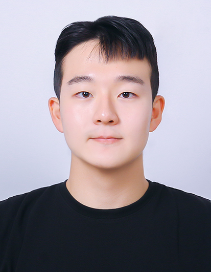

# 감성으로 기술을 디자인하는 개발자, 백승효

Frontend Developer · Metaverse Creator  
📧 shback0926@naver.com | 🌐 [github.com/BaekSeungHyo1](https://github.com/BaekSeungHyo1)

---

## 💡 About Me

창의성과 기술을 결합해 **사람 중심의 인터랙티브 웹 서비스**를 개발하는 개발자입니다.  
메타버스와 프론트엔드 기술에 깊은 관심을 가지고 있으며,  
**차별화된 사용자 경험**을 창출하는 프로젝트에 열정을 쏟고 있습니다.

---

## 🎓 Education

|    기간     |                           교육 내용                           |
| :---------: | :-----------------------------------------------------------: |
| 2023 ~ 2028 | 광운대학교 정보융합학부 졸업 예정 (VT 전공) GPA: 4.3 / 4.5 |

---

## 🏆 Awards

| 연도 |                                        수상 내역                                        |
| :--: | :-------------------------------------------------------------------------------------: |
| 2025 | 노원구 창의서비스 아이디어 MT 공모전 **우수상** – 핵심 기능과 사용자 중심 서비스로 기획 |
| 2026 |                       광운대학교 교내 웹서비스 해커톤 **우수상**                        |
| 2027 |                 전국 창의소프트웨어 경진대회 **대상** (과기정통부 주관)                 |

---

## 💼 Experience

### CHIC 소속 개발자 (2025~)

- GitHub 기반 협업 환경에서 **웹 및 앱 제작 프로젝트** 다수 수행
- Jekyll 포트폴리오 사이트, React 기반 실습용 웹&앱 등 실전 중심의 프로젝트 경험
- **멘토-멘티 활동 및 팀 협업 중심 프로젝트 운영 경험 다수**
- 기획 · 디자인 · 프론트엔드 개발까지 전반적인 역할 수행

### GameMakers 연합 동아리 기획자/프로그래머 (2026~2027)

- Unity 기반 게임 개발 프로젝트에서 **기획 및 기능 개발**을 동시에 수행
- 게임 기획 문서 작성, UI/UX 설계, C# 스크립트 구현 참여

### 광운대학교 소프트웨어 서포터즈 "소원" (2026~2027)

- 초등학생부터 노년층에 이르는 다양한 계층 대상의 **SW 교육 봉사** 진행
- Scratch, 엔트리, Python 등 다양한 교육 툴을 활용해 수업 콘텐츠 기획 및 멘토링 수행

### UMC (University MakeUs Challenge) 프로젝트 팀원 (2027)

- 전국 최대 규모의 대학생 IT 연합 동아리에서 **사이드 프로젝트 실서비스 제작**
- 실사용자를 고려한 기획부터 기능 구현, 배포까지 주도적으로 참여

---

## 🧳 Internship

### EduVerse (2027.01 ~ 2027.03) – 프론트엔드 인턴

- 교육 플랫폼의 학습 분석 대시보드 UI 개선 및 신규 기능 구현
- React와 Chart.js를 활용해 시각화 기능 개발
- GitHub 기반 협업 환경에서 팀 프로젝트 참여

### MetaSpark (2027.07 ~ 2027.08) – 메타버스 서비스 인턴

- Unity 기반 가상 공간 내 UX 개선 작업 및 기능 테스트
- 웹뷰 삽입형 메타버스 기능 기획 및 프로토타입 개발
- Jira · Slack · Notion을 활용한 애자일 협업 환경 경험

---

## 🚀 Projects

### 🧠 무드빌더 (2025)

> 감정 인식 기반 UI 자동 변경 웹앱

- 얼굴 인식/음성톤 기반으로 사용자 감정 파악
- 감정에 맞는 컬러톤·UI 자동 전환 기능

### 🧪 StudyMe (2026)

> AI 개인 튜터 서비스 (GPT API 기반)

- GPT API + React 기반
- 질문 히스토리 자동 정리 및 요약 기능 포함

---

## 📜 Certifications

| 연도 |                        자격증                         |
| :--: | :---------------------------------------------------: |
| 2025 |                  컴퓨터활용능력 2급                   |
| 2025 |                  컴퓨터활용능력 1급                   |
| 2026 |                 오픽(OPIc) – IH 등급                  |
| 2027 |                     정보처리기사                      |
| 2027 |   **Adobe Certified Expert - Web Authoring** (해외)   |
| 2027 |     **Meta Certified Front-End Developer** (해외)     |
| 2028 | **Microsoft Certified: Azure AI Fundamentals** (해외) |

---

## 💻 Skills

- **Frontend**: HTML, CSS, JavaScript, TypeScript, React, Next.js
- **Design**: Figma, Adobe XD, Illustrator
- **Tools**: Git, GitHub, Notion, Slack
- **Etc.**: Unity (기초), Jekyll, ChatGPT API

---

## 📈 Future Goals

- 🌐 웹 개발자 포지션으로 다양한 사용자 기반 서비스 제작
- 🧠 기술 기반 커뮤니티 기획 및 팀빌딩 리더 경험 확장
- 🎯 UX 중심의 메타버스 실무 적용 프로젝트 주도

---

> **기술에 감성을 더한 개발자**로 성장 중입니다.  
> 지금보다 더, 사람을 이해하는 개발자가 되겠습니다.
